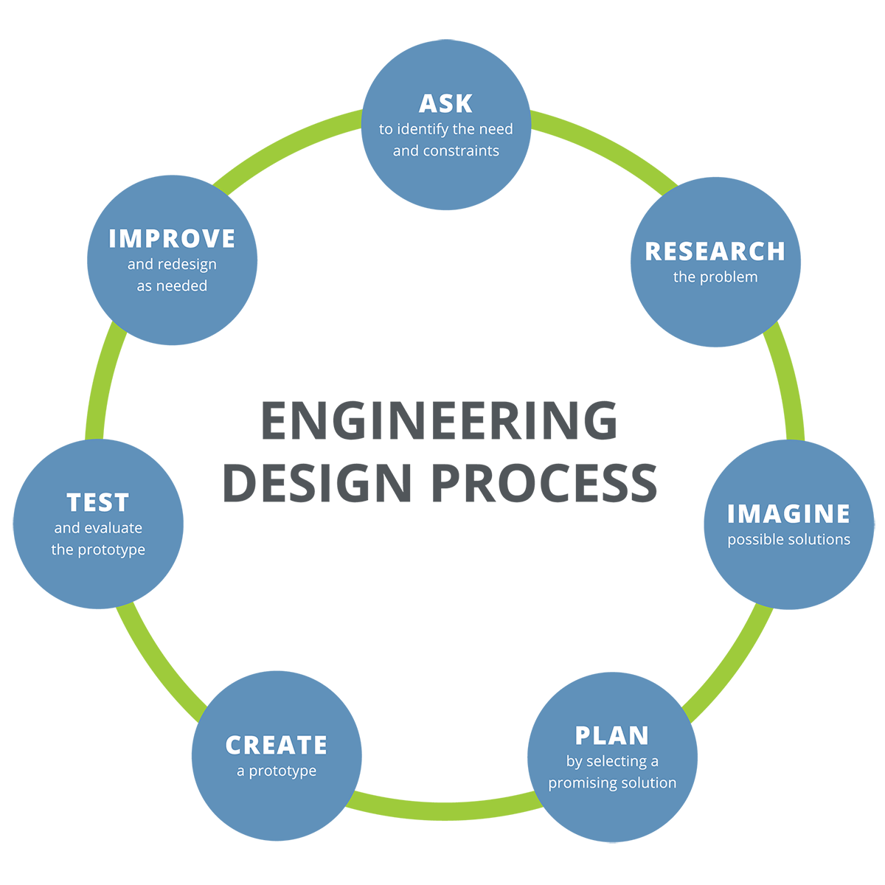

*****
Design Process
*****

On our team, we try our best to follow the engineering design process, which we believe will help us create a successful robot.

  
Claw Design V1 - Passive Claw
#####

Need and Constraints
*********************

Research
*********************

Possible solution
*********************

Prototype
*********************

Test
*********************

Our passive claw design was connected to a motor and tested. We found that there was a flaw in the design as it was not restricted in the x-axis.

Improvements
*********************

To improve this design, we plan on fixing this design flaw and making it easier to print on our printers. We also are considering using a different claw design as many other teams have an easier time scoring with a normal open-close type claw.

=============================

Lift Design V1 - Linear Slides
#####

Need and Constraints
*********************

* Under 14in tall when collapsed (accounts for mounting on 4in wheels)

* Over 30in tall when expanded

Research
*********************

We saw another FTC team on YouTube that used a passive claw design. Our design is based on the pictures this team posted as well as the functionality described in their video.

Possible solutions
*********************

* Linear slides
* Scissor lift
* Elevator

We created the design matrix shown below and decided to build a linear slide for our lifting mechanism. A score was given to each of the mechanism types for the shown categories (1 being bad and 5 being good) and the scores were totaled.

+-----------------+------------+-------------+-------------+-------------+-------+
| Mechanism Type  | Weight     | Foldability | Efficiency  | Consistency | Total |
+=================+============+=============+=============+=============+=======+
| Linear Slide    | 4          | 5           | 1           | 3           | 13    |
+-----------------+------------+-------------+-------------+-------------+-------+
| Scissor Lift    | 4          | 1           | 1           | 1           | 7     |
+-----------------+------------+-------------+-------------+-------------+-------+
| Elevator        | 2          | 4           | 3           | 2           | 11    |
+-----------------+------------+-------------+-------------+-------------+-------+

Prototype
*********************

We found documentation from REV on how to build a linear slide system (https://docs.revrobotics.com/duo-build/linear-motion-kit). We realized we are missing many of the parts that are in the linear motion kit, so we decided to print the parts on our 3D printers.

Test
*********************

When testing our lifting mechanism, we found that there was friction between the stages and the string broke several times.

Improvements
*********************

To fix the friction, we are planning on sanding down the part in between the stages to allow for easier movement. We also want to get more durable string. We also found that the cycle time was a bit slower than we wanted and our lift in general could not support a lot of weight. Because of the difficulty to obtain the parts we need (we 3D printed all of our parts) and the performance of the linear slides, we plan on reconsidering other lifting mechanisms.

Claw Design V2 - Open-Close Claw
#####

Need and Constraints
*********************

Research
*********************

Possible solution
*********************

Prototype
*********************

Test
*********************

Improvements
*********************
