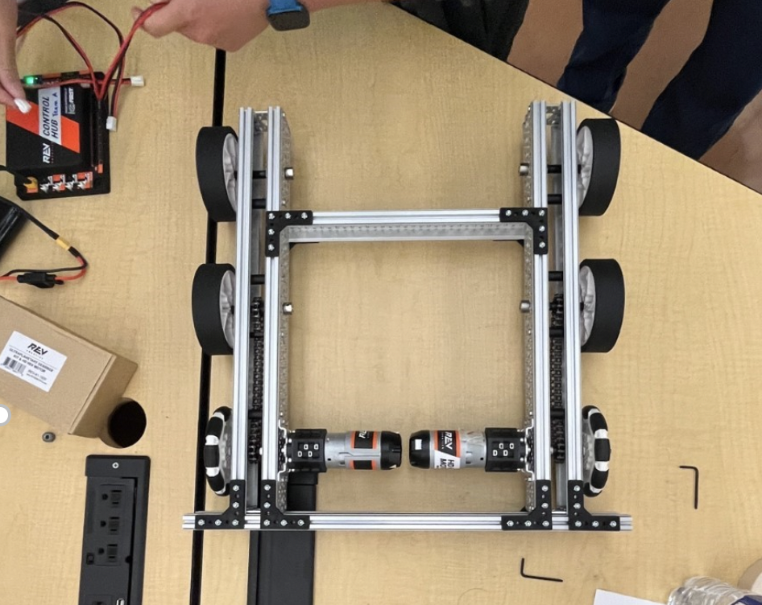
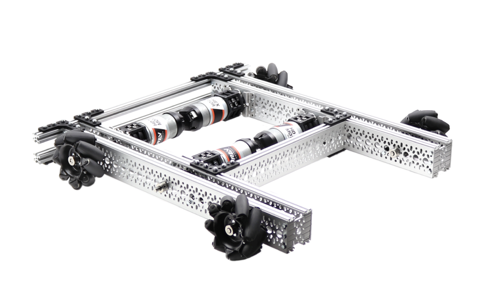
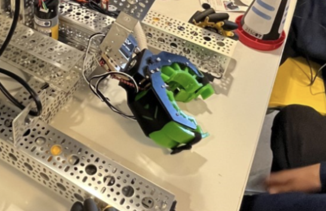
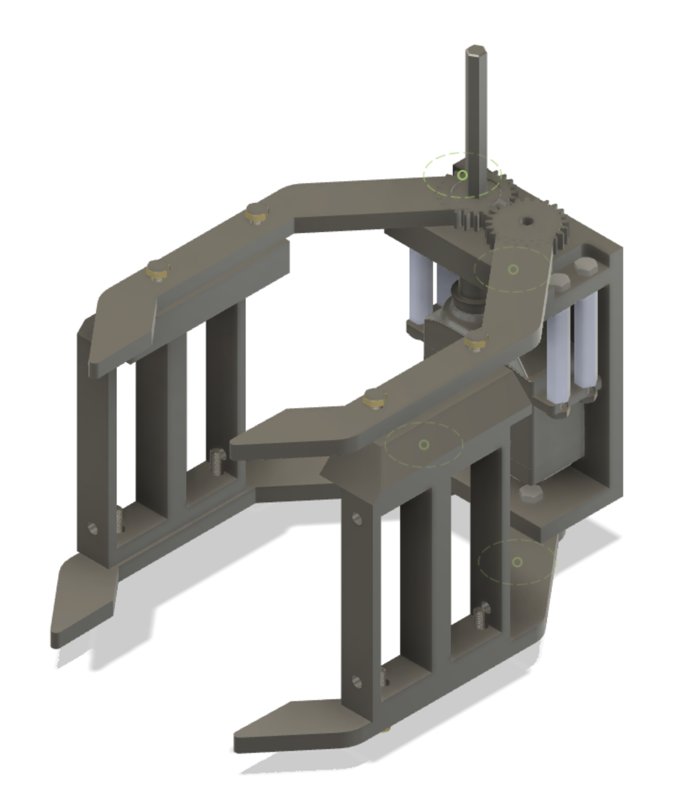
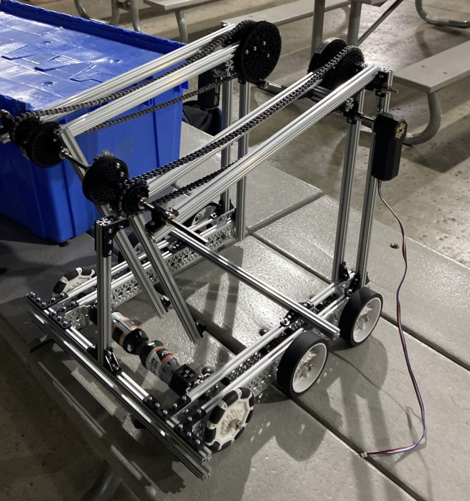

*****
Meeting Documentation
*****

10/10/22 Meeting
#####

Drivebase:
*********************
We started building this drivebase, which includes 2 ultraplanetary gearboxes, 2 omni wheels, and 4 traction wheels. Unfortunately, we found we built the frame of the drivebase incorrectly and will have to rebuild it next meeting.

Lift Design:
*********************

**Needs and Constraints:**

* Under 14in tall when collapsed (accounts for mounting on 4in wheels)

* Over 30in tall when expanded

**Possible solutions:**

* Linear slides
* Scissor lift
* Elevator

We created the design matrix shown below and decided to build a linear slide for our lifting mechanism. A score was given to each of the mechanism types for the shown categories (1 being bad and 5 being good) and the scores were totaled.

+-----------------+------------+-------------+-------------+-------------+-------+
| Mechanism Type  | Weight     | Foldability | Efficiency  | Consistency | Total |
+=================+============+=============+=============+=============+=======+
| Linear Slide    | 4          | 3           | 1           | 3           | 11    |
+-----------------+------------+-------------+-------------+-------------+-------+
| Scissor Lift    | 4          | 1           | 1           | 1           | 7     |
+-----------------+------------+-------------+-------------+-------------+-------+
| Elevator        | 2          | 5           | 3           | 2           | 12    |
+-----------------+------------+-------------+-------------+-------------+-------+

**Prototype:**

We found documentation from REV on how to build a linear slide system (https://docs.revrobotics.com/duo-build/linear-motion-kit). We realized we are missing many of the parts that are in the linear motion kit, so we planned on printing the parts on our 3D printers.

======================================

10/11/22 Meeting
#####

For this meeting, we wanted to accomplish the following tasks:
 
* Take apart the drivebase

* Change the gearbox composition from 4:3 to 4:5

* Rebuild the drivebase based on REV's instructions

We were able to fix the orientation of the gearboxes, and assemble the single sprocket shaft, double sprocket shaft, and the drive shaft for the gear box. Once we can cut and connect the 4 pieces of 28 link chain to their respective sprockets, we can move onto putting all the railings together. We were also able to organize and discuss our building materials so that they are easily accessible to everyone. 

======================================

10/17/22 Meeting
#####

For this meeting, we wanted to accomplish the following tasks:

* Finish assemblying the drivebase

* Create a program that allows the user to control the velocity of a motor using one of the joysticks on the gamepad. 

We were able to finish assemblying the drivebase. We also tested four motors to confirm they work. We also created a program that allows the user to control the velocity of a motor using one (and two) of the joysticks on the gamepad, as well as a program that can test motors (dual-motor and single motor test modes).

  
=============================

10/18/22 Meeting
#####

======================================

10/24/22 Meeting
#####

After we decided to go with the linear slide design, we realized that we didn’t have the specific parts needed to build it. However, after getting an in-depth understanding of how this mechanism worked, we were able to figure out what other parts that we could use in order to accomplish the same task (but we’ll manufacture the specific parts later, since what we were building was just a prototype).

=============================

11/02/22 Meeting
#####

=============================

11/07/22 Meeting
#####

=============================

11/08/22 Meeting
#####

=============================

11/09/22 Meeting
#####

======================================

Plan Until Meet 1 (From 11/21 - 12/3)
#####
Subteam Notes
**********************

Build/CAD: Lukas, Sumedh, Mark, Noe, Priyanshu 

Admin: Emily, David

Programming: Owen, Jadon

**Programming Notes:**

* Figure out auto pathing (watch videos of other teams’ robot auto) 

* Discuss ways for signaling (camera detection – webcam) 

**Admin Tasks:**

* Strategy and games rules summary (list of ways to score, penalties, and other teams’ strategies) 

* Team number plates 

* Banner 

* Alliance color tags 

* Signal sleeve (make one solid color on each side) 

* Engineering Portfolio organization 

* Button/Pin Design (Lightning McQueen) 

* Packing (make list) 

* Put labels on boxes and organize 

* Trifold design 

* Make robot look cool (led lights) 

* Robot + Field inspection checklist 

**Build/CAD Notes:**

* Electrical components: plan out way to secure onto robot 

* Make sure the robot is within the size limit 

Schedule
**********************

**11/21 - 11/27 Thanksgiving Break**

+-------------+---------------------+---------------------+---------------------+
| Subteam     | Monday 11/21        | Tuesday 11/22       | Wednesday 11/23     |
+=============+=====================+=====================+=====================+
| Admin       | Team number plates  | Signal sleeves      | Button designs      |
+-------------+---------------------+---------------------+---------------------+
| Build/CAD   | REV robot           | Design meeting      | CAD robot           |
+-------------+---------------------+---------------------+---------------------+
| Programming | Auto pathing        | Vision with EasyCV  | Vision with EasyCV  |
+-------------+---------------------+---------------------+---------------------+

+-------------+---------------------+---------------------+---------------------+
| Subteam     | Thursday 11/24      | Friday 11/25        | Saturday 11/26      |
+=============+=====================+=====================+=====================+
| Admin       |                     | Design meeting      |                     |
+-------------+---------------------+---------------------+---------------------+
| Build/CAD   |                     | Design meeting      | Full CAD completed  |
+-------------+---------------------+---------------------+---------------------+
| Programming |                     | Design meeting      | Vision completed    |
+-------------+---------------------+---------------------+---------------------+

For the Build/CAD subteam, we decided to split up what we need to CAD between the subteam. Sumedh will CAD the claw, and Owen, Lukas, and Noe will CAD the lift mechanism. We want to have a full CAD of the robot and signal sleeve recognition by the end of Thanksgiving break.

**11/28 - 12/3 Week When School Gets Back**

+-------------+----------------------+---------------------+---------------------+
| Subteam     | Monday 11/28         | Tuesday 11/29       | Wednesday 11/30     |
+=============+======================+=====================+=====================+
| Admin       | Admin tasks          | Admin tasks         |                     |
+-------------+----------------------+---------------------+---------------------+
| Build/CAD   | Claw and drivebase   | Claw and lift       |                     |
+-------------+----------------------+---------------------+---------------------+
| Programming | Auto PID drive       | Auto PID drive      |                     |
+-------------+----------------------+---------------------+---------------------+

+-------------+----------------------+---------------------+---------------------+
| Subteam     | Thursday 12/1        | Friday 12/2         | Saturday 12/3       |
+=============+======================+=====================+=====================+
| Admin       | Admin tasks          | Preparing for comp  | Preparing for comp  |
+-------------+----------------------+---------------------+---------------------+
| Build/CAD   | Lift                 | Preparing for comp  | Preparing for comp  |
+-------------+----------------------+---------------------+---------------------+
| Programming | Mechanisms and autos | Preparing for comp  | Preparing for comp  |
+-------------+----------------------+---------------------+---------------------+

Preparing for competition includes robot inspection, field inspection, packing, practicing driving, practicing being human player, and testing autos.

=============================

Meets and Goals by That Meet
#####

**Meet 1: Sunday 12/4**

* Autos (parking signal) + signal sleeve 

* Consistent terminal, ground, low junction scoring 

* Make beacon 

* Have mecanum drive 

* End game parking 

**Meet 2: Sunday 12/18**

* Consistent Autos + with signal sleeve 

* Consistent terminal, ground, low, medium junction scoring 

* Mecanum drive 

* Have beacon 

* End game parking 

**Meet 3: Sunday 1/8**

* Consistent Autos Parking Signaling 

* Consistent scoring for all junctions + terminal 

* Beacon to own junction 

* Circuit? (the cone in a line thing on the field) 

**ILT 4: Sunday 2/19 (Monrovia HS, Monrovia)**

* Good bot

=============================

11/21/22 Meeting
#####

Chiyo, Samantha, Camille, Sumedh, Owen, and Priyanshu met in person to build the robot. We decided to build an 2-bar arm that would be able to reach the low junction. The arm uses a 5:1 gear ratio and an ultraplanetary gearbox. In the end, the arm was able to reach high enough to score in the middle junction.

=============================

11/22/22 Design Meeting
#####

Chiyo, Samantha, Camille, Sumedh, Emily, Lukas, Owen, and Noe met online to discuss the general design of our robot. We decided we want to build a 4-wheel mecanum drivebase, claw made with compliant wheels and reverse virtual arm for our lifting mechanism. After watching FTC matches at Meet 0 and on YouTube, we found that moving in both the x and y directions is incredibly helpful in this game. So, we decided on a mecanum drivebase like the one shown below, which includes 4 ultraplanetary gearboxes and 4 mecanum wheels.

Additionally, we found that a normal open-close type claw would be easier to prototype effectively before Meet 1. Our mentor, Mr. Duan, suggested that we use compliant wheel for gripping the cone. Below is an image of a claw similar to what we plan to design.

  
For our lifting mechanism, we considered using linear slides, a reverse virtual arm, and elevator in combination with an arm. The factors we considered into our decision include speed, feasibility with our current materials, consistency based on matches we have seen, and stability of the mechanism. We created the design matrix below to decide which mechanism to build, ultimately being a reverse virtual arm. We gave each mechanism a score (1 being bad and 5 being good) and totaled the scores.

+------------------------+------------+-------------+-------------+-----------+-------+
| Mechanism Type         | Speed      | Feasibility | Consistency | Stability | Total |
+========================+============+=============+=============+===========+=======+
| Linear Slide           | 4          | 3           | 5           | 4         | 16    |
+------------------------+------------+-------------+-------------+-----------+-------+
| Reverse Virtual Arm    | 5          | 5           | 5           | 4         | 19    |
+------------------------+------------+-------------+-------------+-----------+-------+
| Elevator and Arm       | 3          | 5           | 4           | 5         | 17    |
+------------------------+------------+-------------+-------------+-----------+-------+

=============================

11/28/22 Meeting
#####

=============================

11/29/22 Meeting
#####

=============================

11/30/22 Presentation
#####

We were tasked by our mentor and Principles of Engineering teacher, Mr. Harder, to present to our class about our robot and competition. This is the presentation that we showed: [INSERT PRESENTATION LINK]

=============================

11/30/22 Meeting
#####

=============================

Claw Design V2 - Open-Close Claw
#####

Need and Constraints
*********************

* Able to hold a cone

* Works with a servo motor

Research and Possible Solution
*********************

We looked at various robots from Meet 0 and on YouTube, many of which had similar open-close claw designs.

  
This claw design comprises of 1 motor mount, 4 "bananas", and 2 "banana" mounts. Originally, our design had standoffs to connect the top and bottom bananas, but we had to custom-design a part after finding out we used all of our standoffs. We also plan on ziptying grippy material to the bananas.

Prototype
*********************

Test
*********************

We tested the claw and it was able to open in close. However, the side with the shaft had some trouble in movement. We figured out that the clearance on the hole, in which a bearing was located, was too large. This meant that the bearing was causing this side to be somewhat free-spinning.

Improvements
*********************

Because the hole for the side with the shaft was too large, we redesigned the claw with a hexagon in the banana. The hexagon was measured to be the size of the shaft, so the shaft could directly control the banana's movement.

=============================

11/28/22 Meeting
#####

We finished designing the claw we 3D printed the parts and began assembling it.

=============================

11/29/22 Meeting
#####

We finished assembling the main parts of the claw. All we have left to do for the claw is ziptyping the grippy material and testing it.

=============================

11/30/22 Meeting
#####

Sumedh built the reverse virtual arm! Here is picture of the lifting mechanism mounted on the robot:

  
We also tested the claw. Here is a video of it opening and closing:

[INSERT VIDEO]

There was a problem with the side of the claw connected to the shaft. It would move sometime and not move at all other time, but it always moved less smooth than the other side. We realized that the hole for the bearing was slightly too large so we redesigned the motor mount part to work without a bearing (a hexagon shaped hole makes it so the banana is directly controlled by the shaft).

=============================

12/02/22 Meeting
#####

We tested the reverse virtual arm and found that it could reach the high junction!

=============================

12/03/22 Meeting
#####

Because of the limited time we had before the meet, we created an hour-by-hour schedule to make sure we got everything we need to done. Schedule:

1-2:30 : finish any fixes + additions on robot

2:30-3 : inspection + prog check

3-4 : driving practice

4-5 : anything else we can do to prepare for meet

=============================

12/04/22 Competition - Meet 1
#####
