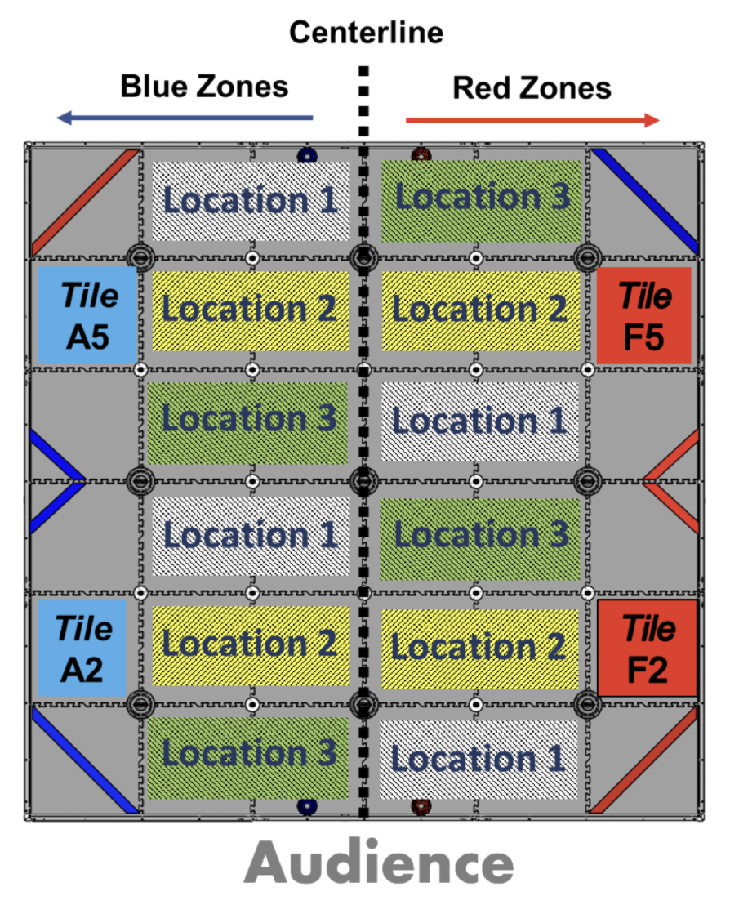
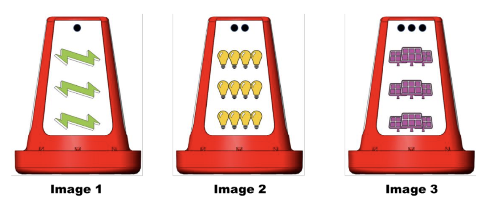

*****
Programming
*****

Teleop
#####

Macros
******

Autonomous
#####

Vision - Signal Sleeve Recognition
#####

A critical aspect of scoring this year requires the application of computer vision.  The objective is to identify and analyze an image on a signal cone and then autonomously navigate and park in one of three different zones, accordingly.  

The figure below shows the robot starting points (Tile A5, Tile A2, Tile F5, and Tile F2) and the three possible locations or zones that the robot would need to park in to score 10 or 20 points. 

To determine which location to park in, the robot utilizes a webcam to analyze a signal cone. The default cone signals are shown below. Image 1 corresponds to Location 1, Image 2 corresponds with Location 2, and Image 3 corresponds with Image 3.

However, the usage of the default signals warrants only 10 points. To achieve the full 20 points, teams need to use their own custom signals. 

There are a couple signal types and forms of analysis we considered using:

1. Use different images and utilize machine learning to generate an image classification model

+--------------------------------------------+----------------------------------------------------------+
| Pros                                       | Cons                                                     |
+============================================+==========================================================+
| Effective in an assortment of backgrounds  | “Black box” problem                                      |
+--------------------------------------------+----------------------------------------------------------+
|                                            | Possible issues with specificity                         |
+--------------------------------------------+----------------------------------------------------------+
|                                            | Often requires extensive training and high-quality data  |
+--------------------------------------------+----------------------------------------------------------+

2. Use solid colors with extreme and different RGB values; analysis with EasyOpenCV

+--------------------------------------------+----------------------------------------------------------+
| Pros                                       | Cons                                                     |
+============================================+==========================================================+
| Quick                                      | Lighting changes may affect the method’s sensitivity     |
+--------------------------------------------+----------------------------------------------------------+
| Relatively simple and easy to setup        | Similar colors in the peripheral can affect specificity  |
+--------------------------------------------+----------------------------------------------------------+
| Can be analyzed from different view angles |                                                          |
+--------------------------------------------+----------------------------------------------------------+

3. Use AprilTags, QR code-like fiducial markers; analysis with OpenCV

+-------------------------------------------+----------------------------------------------------------+
| Pros                                      | Cons                                                     |
+===========================================+==========================================================+
| Effective in an assortment of backgrounds | Difficult for humans to differentiate and identify       |
+-------------------------------------------+----------------------------------------------------------+
| Effective in different lighting           |                                                          |
+-------------------------------------------+----------------------------------------------------------+
| Fast & lightweight                        |                                                          |
+-------------------------------------------+----------------------------------------------------------+
| Can be analyzed from various view angles  |                                                          |
+-------------------------------------------+----------------------------------------------------------+
| High specificity; high sensitivity        |                                                          |
+-------------------------------------------+----------------------------------------------------------+
